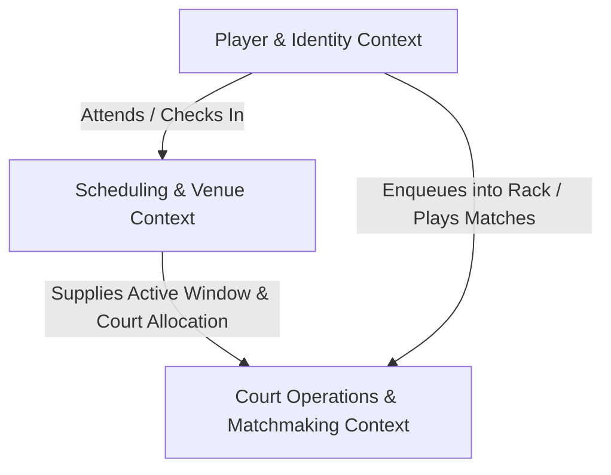

# Context Map: Wordcomm Pickleball

This document outlines the bounded contexts within the Wordcomm Pickleball system and defines their relationships and integration boundaries.

---

## Bounded Contexts

### 1. `Scheduling & Venue` (`docs/contexts/scheduling/CONTEXT.md`)
- **Domain Focus**: Management of physical venue access, provider-level court bookings, and scheduled community play blocks.
- **Key Concepts**: `CourtProvider`, `CourtRental`, `PlaySchedule` / `PlaySession`, `SessionHost`.
- **Invariants**:
  - Community play happens exclusively within authorized 3–5 hour windows strictly managed by the Court Provider.
  - Courts cannot host matches outside an active session window.
  - Every active session designates a registered player as `SessionHost`.

### 2. `Court Operations & Matchmaking` (`docs/contexts/court-operations/CONTEXT.md`)
- **Domain Focus**: Real-time court utilization, live score tracking, FIFO paddle rack queuing, and player matchmaking.
- **Key Concepts**: `Court`, `PaddleRack`, `MatchmakingMatch`, `CourtStatus`, `SessionHost`.
- **Relationship to Scheduling**: Consumes session window state and designated `SessionHost` credentials to enable/disable court dispatching, track court availability, and authorize administrative match/score overrides.

### 3. `Player & Identity` (`docs/contexts/player-identity/CONTEXT.md`)
- **Domain Focus**: Host-managed paddle profiles, nickname identifiers, DUPR ratings & skill tiers, and simplified paddle visual indicators. (Player self-service progression, XP, badges, and quests are parked for future reactivation).
- **Key Concepts**: `Player` / `PaddleProfile`, `SkillTier`, `DUPRRating`, `PaddleVisual` (`PaddleConfig`).

