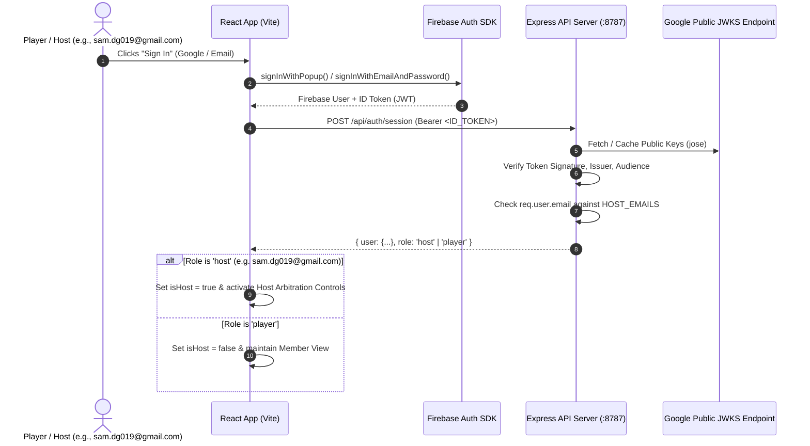

# Lightweight Firebase + Express JWKS Host Authentication Design

## 1. Overview & System Architecture

This design specifies a lightweight, serverless-friendly authentication and role-based access control (RBAC) architecture for **Wordcomm Pickleball**. It pairs **Firebase Authentication** on the client with **Google Public JWKS token verification via `jose`** on an Express backend, adhering strictly to the domain model and ubiquitous language where administrative authority is designated as **Host** (`SessionHost`).



---

## 2. Ubiquitous Language & Role Adherence

| Spec Concept | Wordcomm Ubiquitous Language | Context & Responsibilities |
|---|---|---|
| `admin` | **`host` / `SessionHost`** | Registered user with elevated operational control over active play sessions, court score overrides, and queue arbitration. |
| `user` | **`player` / `Member`** | Standard authenticated club member with DUPR rating, paddle customization, and rack enqueue capabilities. |
| `ADMIN_EMAILS` | **`HOST_EMAILS`** | Environment variable containing whitelist of host emails (configured with `sam.dg019@gmail.com`). |

---

## 3. Environment Variables Contract

### Client (`.env` / Vite)
```ini
VITE_FIREBASE_API_KEY="AIzaSy..."
VITE_FIREBASE_AUTH_DOMAIN="wordcomm-pickleball.firebaseapp.com"
VITE_FIREBASE_PROJECT_ID="wordcomm-pickleball"
VITE_FIREBASE_STORAGE_BUCKET="wordcomm-pickleball.firebasestorage.app"
VITE_FIREBASE_MESSAGING_SENDER_ID="1234567890"
VITE_FIREBASE_APP_ID="1:1234567890:web:abcdef"

# Optional backend API base URL (empty string when proxied via Vite)
VITE_API_BASE_URL=""
```

### Server (`.env` / Express)
```ini
PORT=8787
NODE_ENV=development
FIREBASE_PROJECT_ID="wordcomm-pickleball"

# Comma-separated list of authorized host emails (case-insensitive)
HOST_EMAILS="sam.dg019@gmail.com"
ADMIN_EMAILS="sam.dg019@gmail.com"

# CORS Origin
CORS_ORIGIN="http://localhost:3000,http://localhost:5173"
```

---

## 4. Backend Implementation (`server/`)

### 4.1. Auth Middleware (`server/auth.ts`)
* **Public Key Verification:** Uses `jose.createRemoteJWKSet` with Google's public endpoint `https://www.googleapis.com/service_accounts/v1/jwk/securetoken@system.gserviceaccount.com`.
* **Host Whitelist:** `getHostEmails()` parses and normalizes `HOST_EMAILS` (and fallback `ADMIN_EMAILS`) to a trimmed, lowercase list.
* **`isHostEmail(email?: string): boolean`:** Returns `true` if the email matches `sam.dg019@gmail.com` or any entry in `HOST_EMAILS`.
* **`authenticate(req, res, next)`:** Extracts Bearer JWT, verifies signature, issuer (`https://securetoken.google.com/<projectId>`), and audience (`projectId`). Attaches decoded payload `{ uid, email, name, picture }` to `req.user`.
* **`requireHost(req, res, next)`:** Ensures `req.user` is present and `isHostEmail(req.user.email)` is true. If unauthorized, responds with `403 Forbidden`.

### 4.2. Express API Routing (`server/index.ts`)
* `POST /api/auth/session`: Authenticates user and returns `{ user: req.user, role: isHost ? 'host' : 'player' }`.
* `GET /api/health`: Health status endpoint.

---

## 5. Frontend Implementation (`src/`)

### 5.1. Firebase Client Initialization (`src/lib/firebase.ts`)
* Initializes Firebase App with `firebase/app` and exports `auth` from `firebase/auth` and `googleProvider`.

### 5.2. API Client with Auto-Token Attachment (`src/utils/api.ts`)
* Auto-resolves `auth.currentUser?.getIdToken()`.
* Automatically attaches `Authorization: Bearer <token>` for `/api/*` requests.
* Exposes `api.syncSession()` for session role validation.

### 5.3. Auth Context (`src/context/AuthContext.tsx`)
* Manages authentication state:
  * `user: User | null`
  * `role: 'host' | 'player' | null`
  * `isHost: boolean`
  * `loading: boolean`
  * `signInWithGoogle()`, `signInWithEmail(email, password)`, `signUpWithEmail(email, password)`, `signOut()`
* Synchronizes role automatically on `onAuthStateChanged`.

### 5.4. UI Integration (`src/components/AuthModal.tsx` & `src/App.tsx`)
* **`AuthModal`:** Modal allowing Google sign-in and email/password sign-in and registration with Wordcomm brand aesthetic.
* **Header & Profile Integration:** Shows sign-in trigger when logged out; displays user avatar, DUPR rating, and Host status pill when signed in.
* **Host Controls:** Directly controls `isHost` state in `SessionHostBanner`, `PaddleRack`, and `CourtsView`.

---

## 6. Security Invariants

1. **Zero Secret Keys on Server:** Backend verifies Google JWT signatures using Google's public JWKS endpoint without needing private service account credentials.
2. **Normalized Whitelist Matching:** Host email checks are trimmed and lowercased before comparison.
3. **Fail-Closed Permissions:** If `HOST_EMAILS` is empty or missing, all `requireHost` checks fail closed with `403 Forbidden`.
4. **Instant Token Refresh:** Firebase SDK auto-refreshes ID tokens transparently on client requests.
